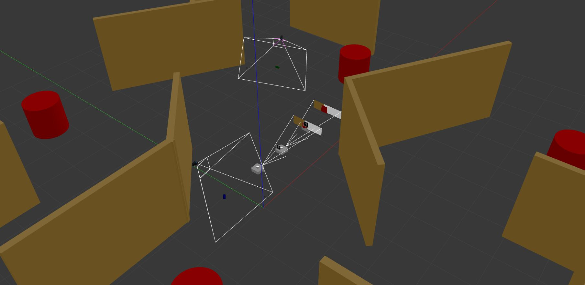

# ROS packages for the final project

## Prerequisites

### Create a new workspace and clone the repository

```bash
mkdir -p ~/enpm605_final_ws/src
cd ~/enpm605_final_ws/src
git clone -b final_project https://github.com/zeidk/enpm605_spring2024_ros.git
cd ~/enpm605_final_ws
colcon build
```
### Edit the .bashrc file

* Edit the .bashrc file to source the new workspace
* Add the following line:
```bash
export GAZEBO_MODEL_PATH=$GAZEBO_MODEL_PATH:<path to the models folder>
# Example:
export GAZEBO_MODEL_PATH=$GAZEBO_MODEL_PATH:/home/zeid/enpm605_final_ws/src/enpm605_spring2024_ros/enpm605_final_project/models
```
### Test the installation

```bash
ros2 launch final_project final_project.launch.py
```
The environment should load with two robots.




